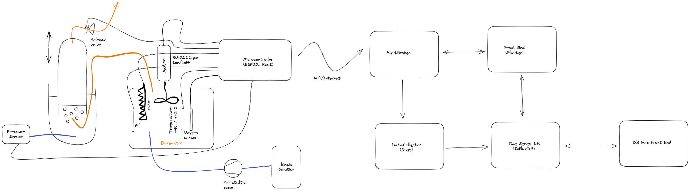

# BioReactor

This is an open source design of a BioReactor system including:
  - hardware
  - sensors
  - microcontroller with network connectivity
  - message broker
  - time series database
  - cross-platform front-end for monitoring and control (mobile & desktop)

